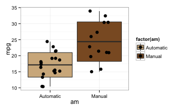

---
title: "Motor Trend Regression Models Project"
output: pdf_document
--- 
  
### Introduction
Motor Trend is a magazine about the automobile industry. The data used in this analyis was extracted from the 1974 Motor Trend US magazine, and comprises fuel consumption and 10 aspects of automobile design and performance for 32 automobiles (1973–74 models).
The variables object of the study were:  
mpg: Miles/(US) gallon, cyl: Number of cylinders, disp: Displacement (cu.in.), hp: Gross horsepowerwt, drat: Rear axle ratio, wt: Weight (lb/1000), qsec: 1/4 mile time, vs: V/S, am: Transmission (0 = automatic, 1 = manual), gear: Number of forward gears, carb: Number of carburators  

### Executive Summary
This report's scope is to answer/investigate to the following aspects:  
- Is an automatic or manual transmission better for MPG?  
- Quantify the MPG difference between automatic transmission and manual transmission.

Using the stepwise regression, a technique that automates the procedure of trying different combinations of variables to find a good compromise of model simplicity and $R^2$, the best model has been identified, with an $R^2$ of 0.85 (the model explaines the 85% of the variabilityof MPG). The variables that have an impact on the MPG are: Weight, 1/4 mile time and Transmission. All the coefficients are significant as relative p-values are < the $\alpha$ which is set to 0.05.
Holding weigth and 1/4 mile time constant, a car with manual transmission generates 2.94 MPG more than one with automatic transmission. So we can conclude that Manual Transmission is better than Automatic Transmission in terms of MPG.

#### Exploratory Data Analyisis
According to the exploratory data analysis (graph available in the Appendix), it seems that the manual transmission allows a better MPG: an average of 24.39 MPG for the manual vs an average of 17.14 MPG for the automatic. 

#### Simple Regression Model
Let's built a regression model with MPG as outcome and the the transmission as independent variable.

```r
data(mtcars)
mtcars$am <- factor(mtcars$am, levels=c(0:1), labels=c("Automatic","Manual"))
fit1 <- lm(mpg ~ am,mtcars)
summary(fit1)$coefficients
```

```
##              Estimate Std. Error   t value     Pr(>|t|)
## (Intercept) 17.147368   1.124603 15.247492 1.133983e-15
## amManual     7.244939   1.764422  4.106127 2.850207e-04
```

```r
summary(fit1)$adj.r.squared
```

```
## [1] 0.3384589
```

#### Model Interpretation
Although the transmission p-value (Pr(>|t|)) is extremely low (< 0.05), and therefore the coefficients is highly significative, the adjusted $R^2$ is not very high (about 0.34), that means that this model can explain only the 34% of the variance of the MPG variable. According to this model, on average, a car with manual transmission has 7.24 MPG more than a car with automatic transmission.


### Multiple Regression Models
In order to better evaluate the impact of the transmission on the MPG we will built a more significative model. This will be performed using the function "step" that automates the procedure of trying different combinations of variables to find a good compromise of model simplicity and $R^2$.
This trade-off is formalized by the Akaike Information Criterion (AIC). It can be thought as the quality of the model with a penalty for the number of variables in the model. (The lower the AIC the better is the model.)

```r
fit_all <- lm(mpg~.,mtcars)
step(fit_all,trace=FALSE)
```

```
## 
## Call:
## lm(formula = mpg ~ wt + qsec + am, data = mtcars)
## 
## Coefficients:
## (Intercept)           wt         qsec     amManual  
##       9.618       -3.917        1.226        2.936
```


```r
fit_best <- lm(mpg ~ wt + qsec + am, data = mtcars)
summary(fit_best)$coefficients
```

```
##              Estimate Std. Error   t value     Pr(>|t|)
## (Intercept)  9.617781  6.9595930  1.381946 1.779152e-01
## wt          -3.916504  0.7112016 -5.506882 6.952711e-06
## qsec         1.225886  0.2886696  4.246676 2.161737e-04
## amManual     2.935837  1.4109045  2.080819 4.671551e-02
```

```r
summary(fit_best)$adj.r.squared
```

```
## [1] 0.8335561
```

#### Model Interpretation
We set our Hyphotesis:   
$H_{0}: \beta = 0$  *(a particular variable is not a significant predictor)*  
$H_{A}: \beta \neq 0$  *(the variable is a significant predictor)*  
We set the $\alpha$ to 0.05.
According to the model, we see that the variables that have an impact on the MPG are: Weight, 1/4 mile time and Transmission. Since all the coefficients have p-values that are < the $\alpha$, we reject the null hypothesis that each of those variables is not a significant predictor, that means that the variables are significant predictors.  
If we interpret the coefficients, we can say that holding weigth and 1/4 mile time constant, a car with manual transmission generates 2.94 MPG more than one with automatic, therefore we can conclude that the Manual Transmission is better than the Automatic in terms of MPG.
 
#### Model Diagnostic
The 4 plots diagnostic (available in the appendix) can be used to evaluate fit and residuals of the model. *Residuals vs Fitted* Plot: the residuals are scattered randomly around zero --> a linear model is appropriate. The *Normal Q-Q* plot shows that the residuals are normally distributed. The *Scale-Location* Plot shows that the variance is pretty much consistent across the range of x-values. The *Residuals vs Diagnostic* plot shows that no influential points are  overwhelmingly influencing the characteristics of the Regression line. 


\newpage   

## Appendix  
  
**md file and figures available in github:** https://github.com/annieg73/RegressionModels 
  
### Boxplot with average, 95%CI, min and max.

 


### Diagnostic Analysis  

 
